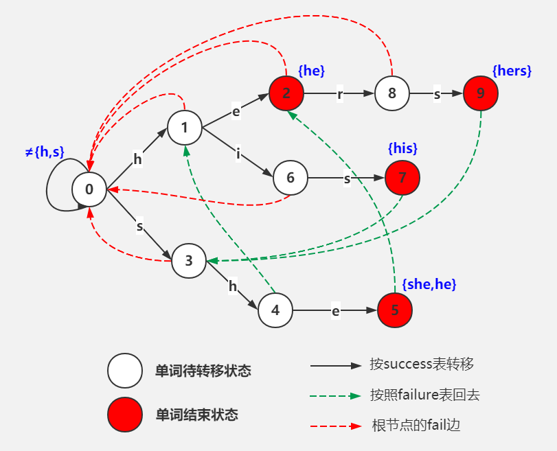

# 模式匹配算法
## 单模式匹配
### 朴素匹配
最直接的想法是暴力(Brute Force)匹配，即将文本串的第一个字符与模式串的第一个字符进行匹配

若相等则继续比较文本串的第二个字符与模式串的第二个字符。

若不等，则比较目标串的第二个字符与模式串的第一个字符，依次比较下去，直到得到最后的匹配结果。

暴力(Brute Force)匹配过程中存在重复匹配，KMP算法优化了匹配过程。在匹配失败时，文本串的指针不需要回退。

### KMP
KMP算法在匹配到某个字符失败时，文本串的匹配指针不会回退

模式串则根据部分匹配表(也叫next数组) 向右滑动一定距离后继续与上次在文本串中不匹配的位置进行匹配

若仍不匹配，则继续根据部分匹配表向右滑动模式串

重复上述不匹配–滑动的过程

当匹配指针指到模式串的初始位置依然不匹配，则模式串向右滑动一位，文本串的匹配指针向前移动一位

若匹配，则继续匹配其他位置的字符

当匹配指针连续匹配的字符数与模式串的长度相等，则匹配完成

```java

```

## Trie
Trie又叫前缀树或字典树，是一种多叉树结构

Trie这个术语来源于retrieval(检索)，其是一种用于快速检索的数据结构

其核心思想是利用字符串的公共前缀最大限度地减少不必要的字符串比较，提高查询(检索)效率，缺点是内存消耗大

Trie树的基本性质：

- 根节点不包含字符，除根节点外的每一个子节点都包含一个字符
- 从根节点到某一个节点，路径上经过的字符连起来为该节点对应的字符串
- 每个节点的所有子节点包含的字符互不相同

应用场景

- 前缀匹配(自动补全)：返回所有前缀相同的字符串
- 词频统计：将每个节点是否构成单词的标志位改成构成单词的数量
- 字典序排序：将所有待排序集合逐个加入到Trie中，然后按照先序遍历输出所有值
- 分词
- 检索

## 多模匹配–AC自动机
AC自动机<font color=red>**首先将多模串构建(与Trie树的构建类似)为确定有限状态自动机(DFA)，然后按照文本串中的字符顺序依次接收字符，并发生状态转移。**</font>

状态中缓存了如下三种情况下的跳转与输出：
- 按字符转移成功，但不是模式串的结尾。即成功转移到另一个状态，对应success/goto
- 按字符转移成功，是模式串的结尾。即命中一个模式串，对应emits/output
- 按字符转移失败，此时跳转到一个特定的节点，对应failure。从根节点到这个特定的节点的路径恰好是失败前的文本的一部分，类似KMP算法中利用部分匹配表来加速模式串的滑动从而减少重复匹配

上述匹配过程只需扫描一遍文本串，其时间复杂度为O(n),与模式串的数量和长度无关。

<font color=red>**AC自动机可简单看成是在Trie树上通过KMP来实现多模串的匹配。**</font>

<font color=red>**其中Trie树负责状态转移，KMP负责减少重复匹配。**</font>

### AC自动机中fail路径的构建

AC自动机的构建虽然与Trie树的构建类似，但其fail路径(**本质是一种回溯，避免重复匹配**)是AC自动机中特有的。

具体构建(**从离根节点由近及远的节点逐步构建**)逻辑为(**每个节点都有一条发出的fail路径**)：
- 如果自己是根节点，则指向自己
- 如果自己的父节点是根节点，则指向根节点
- 找到自己父节点fail路径指向的节点，如果这个节点可以正常接收自己的输入字符，那么就指向这个节点接收自己输入字符后所指向的那个节点
- 如果自己父节点fail路径指向的节点不满足，就按第3步的判断，检查自己父节点的父节点的fail路径指向的节点
- 一直父节点、父节点、父节点这样的回溯，直到根结点还没找到就指向根节点

以经典的ushers为例，模式串是he、she、his、hers，文本为“ushers”。构建的自动机如图：


其中实线部分是一颗Trie树，虚线部分为各节点的fail路径。
